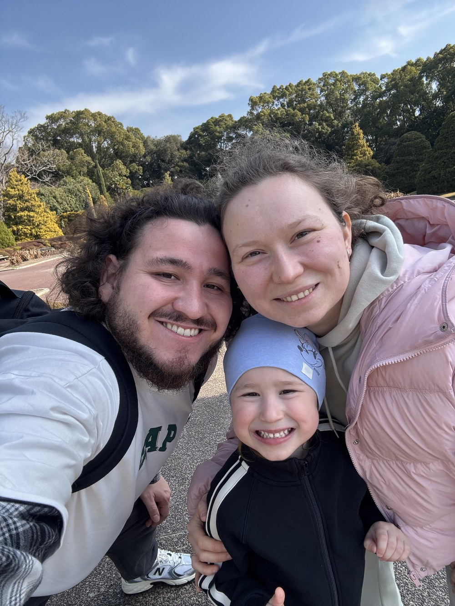

<div align="center">

# Rustem Idiiatullin
### AI Product Engineer · clinical-conversation AI

**I built an AI medical scribe — it records a doctor–patient visit and turns it into a
signed, honest clinical note — and it runs in a real clinic every day. Solo, end to end.**

<br/>


[](mailto:rust.idi98@gmail.com)
[](https://linkedin.com/in/rustem-idiatullin)

**[🩺 The product →](https://github.com/rustidi98/signalo-showcase)**  ·  **[🤖 How I build with AI →](https://github.com/rustidi98/ai-engineering-showcase)**  ·  **[✉️ Email me →](mailto:rust.idi98@gmail.com)**

</div>

---

## The short version

I'm a founder and hands-on AI product engineer. I built **Signalo** — an AI platform for medical
clinics — end to end: the iOS and Android apps, the web portal, the backend, and the AI pipeline that
runs it. It listens to a visit, turns messy audio into a structured clinical note, and stops the model
from inventing anything that wasn't said. It's used every day in a clinic doing **~$5.1M a year**.

Before software I spent years building and selling my own companies — which is why I build for what
survives real use, not for a demo. Most people who can prompt an AI can't ship a medical product; most
engineers who can, don't also own the product judgment behind it. I do both — and there's a clinical
product in daily production to prove it.

### Proof, not adjectives

| | |
|:---|:---|
| **Speech-to-text** | Self-hosted **GigaAM-v3** — Golos Farfield **WER 3.9%** vs **16.4%** for Whisper large-v3 on Russian. I run the model myself for cost, language quality, and privacy. |
| **Honest notes** | A model, left alone, invents tidy clinical detail that was never said. Eval gates **block a deploy** if grounding regresses — **CRITICAL 100% / HIGH 95%+**, grounding is pass/fail, coverage checked against visit duration. |
| **Reliability** | "False logout" — users booted mid-visit — recurred **8 times** before I fixed it at the principle, not the symptom: only end a session when it's *positively* dead, never on a network blip. |
| **Built solo, fast** | **~2,700 commits across ~3 months**, one person — a production platform at small-team pace, without cutting corners. |
| **In production** | Daily use in a real, paying clinic. A second product, **Signalo Smile**, lifted **case acceptance ~20%**. |

---

## 🤖 How I build

Up front, because it's the whole point: **I build by directing AI, not by hand-writing code.** I own
the architecture, break the work into pieces, steer coding agents (Claude, Codex), review every change —
and debug what they can't. When users were getting logged out mid-visit, I found it in the production
token table, not by re-prompting a model. I read, verify, and stand behind everything that ships.

My edge is **leadership, business logic, and product judgment** — seeing how a thing should work, how
people actually use it, and getting production-grade output from a team, human or AI. **The code is the
output; the judgment is the work.**

It's real software all the same — iOS (Swift), Android (Kotlin), a Next.js web app, a NestJS backend,
and GPU workers for the AI — and I designed and directed every part of it. To do it solo at this pace I
built a *system* around the AI: reusable skills, a fleet of adversarial review agents, and machine gates
that fail a bad deploy before it ships. That system is a repo of its own → **[ai-engineering-showcase](https://github.com/rustidi98/ai-engineering-showcase)**.

> **For a senior reviewer:** I'll defend five specific trade-offs — a 365-day refresh token, running my
> own GPU speech model, an always-on reaper for stuck jobs, guards that can *reject* an AI note, and
> deterministic-before-model. The reasoning behind each →
> **[the interview guide](https://github.com/rustidi98/signalo-showcase/blob/main/INTERVIEW_GUIDE.md)**.

## 📦 Where to look

The product code stays private — patient data and a live commercial product. These repos are the
*story* of what I built and how, with clean, representative examples.

| Repo | What it shows |
|:---|:---|
| 🩺 **[signalo-showcase](https://github.com/rustidi98/signalo-showcase)** | The AI medical scribe — architecture, real trade-offs, postmortems, the eval harness that keeps notes honest. **Start here.** |
| 🤖 **[ai-engineering-showcase](https://github.com/rustidi98/ai-engineering-showcase)** | How one person ships a product this size with AI — the skills, the review agents, the gates. Installable. |

<details>
<summary>📚 <b>More case studies</b> — systems &amp; data-engineering depth (hand-built, pre-AI-orchestration)</summary>

<br/>

| Repo | What it shows |
|:---|:---|
| 📚 **[tasks-knowledge-showcase](https://github.com/rustidi98/tasks-knowledge-showcase)** | A knowledge &amp; task platform — notes, databases-in-documents, an AI workspace. RLS as a real security boundary; raw SQL, no ORM crutches. |
| 📞 **[callbase-showcase](https://github.com/rustidi98/callbase-showcase)** | Data engineering at scale — large contact databases: import, dedup, filter, export. Keyset pagination, advisory locks, a hand-rolled pool. |

These predate the AI-orchestration story on purpose — they're the hand-engineering underneath it.

</details>

## 🩺 What Signalo does, and what I work on

In every appointment, important things get said — what the patient wants, what was promised, what was
discussed. Normally that lives in one person's head and is lost the moment they leave. Signalo records
the visit, turns the audio into a structured note, and unifies it with the clinic's CRM and
practice-management system — so the knowledge stays with the clinic, not just the person. On top of that
it coaches staff on how they talk with patients and flags what's slipping through (a big treatment plan
discussed, no follow-up booked).

The parts I own end to end:

1. **Conversations → clear notes.** Messy, real audio into structured medical notes — with safeguards
   against invented facts and eval checks so swapping a model can't quietly make notes worse.
2. **Speech-to-text at scale.** A self-hosted GPU system (GigaAM-v3) that transcribes visits, separates
   who is speaking, and recognises staff by voice across visits.
3. **Medical data done right.** Records you can sign and lock, a full history of every change, and strong
   privacy — the bar a real clinic and its lawyers expect.
4. **An AI-orchestrated way of building.** Reusable tools, review agents and automatic gates that let one
   person build and run a product this size without cutting corners.

## 🏗️ How it's built

```
 iOS · Android · Web  →  NestJS API  →  BullMQ workers  →  GPU speech-to-text (self-hosted · GigaAM-v3)
                             │                                    │
                    PostgreSQL · Redis · object storage    AI pipeline (Claude · Gemini)
                             │
     Medical notes · Coaching · CRM auto-notes · Owner analytics · practice-management + CRM sync
```

Three rules I hold the work to:

- **Honest output over a good demo.** If a clinical detail couldn't be confirmed, it's never shown as a
  fact. Stopping the model from inventing isn't a nice-to-have — it *is* the product.
- **Reliable even when the parts aren't.** Networks drop, GPU workers die mid-job, uploads stall. The
  engineering is mostly about making each of those honest and recoverable instead of silently broken.
- **Cost is a feature.** Every AI call is priced and tracked; moving the GPUs to scale-to-zero killed a
  ~$20/day leak without hurting speed. If a plain rule does the job, it doesn't get an expensive model.

## 😁 Signalo Smile — a second product, +20% case acceptance

**Signalo Smile** shows a patient their future smile, instantly, right in the chair. Patients see the
result before they commit — which is exactly when they say yes — and in the clinic it lifted **case
acceptance by ~20%**. Another product born from a real problem in a clinic, built the same way: me,
directing AI.

## 🧭 Track record

Before I built software, I built and ran my own businesses. When it's your own money and your own
customers on the line, a nice demo means nothing — what matters is whether it actually works.

| When | What | Notes |
|:---|:---|:---|
| **2026 → now** | **Signalo** — Founder &amp; builder | AI medical scribe for clinics, built solo, used every day in a paying dental clinic |
| **2023 – 25** | **Matrius** — Director of Marketing (CMO) | Children's-education company. Joined at ~**$190K/mo** revenue, grew it to ~**$380K/mo** (company ~**$4.5M/yr**) at **350–400% ROMI**; ran a 15-person team; offered equity |
| **2020 – 23** | **StudyWay** — Founder &amp; CEO | Online exam-prep school — grew to **~1,000 students/yr** and a team of 50, then **sold it in 2023** |
| **2017 – 20** | **Electronics retail** — Founder &amp; Owner | My own **Apple &amp; Xiaomi shop** — grew it to **$64–90K/mo**, then **sold it in 2020** |
| **2012 – 16** | **First ventures, from age 14** | Fixing **Apple devices** — from a bench at home to a repair centre |

<details>
<summary>📖 <b>The longer story</b> — from a repair bench to production AI</summary>

<br/>

I've been building and fixing things since I was a kid. It started at home, repairing Apple phones and
laptops at the kitchen table. That turned into a job at a repair centre, and then my own shop selling and
fixing Apple and Xiaomi devices. I was young, and already running the whole thing myself.

Then I went bigger. I started an online school that prepared kids for their exams, grew it to about 1,000
students a year and a team of 50, and sold it. After that I ran marketing at a children's-education
company, leading a 15-person team and growing revenue past ~$4.5M a year.

Then I found the problem I really cared about: healthcare, and I focused on dental clinics. This time I
made a choice that surprised people — instead of hiring engineers or just running the business, I'd build
the product myself. Not by becoming a classic programmer, but by getting very good at directing the AI
that writes the code. Signalo runs in a real clinic every day, and I directed and shaped every part of it
— the apps, the website, the backend, the AI. I understand exactly why it works, because I built all of it.

</details>

## 🤝 How I work with people

I've led teams of up to 50 people. Two things come up again and again from people who worked for me: I
bring order to messy, chaotic work, and I actually invest in the people doing it — a growth plan for each
person, honest feedback, and clear standards the team can rely on.

> "Rustem can bring order to the messiest processes fast — and he showed me by his own example what a
> genuinely invested head of marketing looks like. After he left, I was promoted to Head of Marketing on
> the system he built."
> — **Vasilisa Levina**, my Performance Marketing lead → now at Yandex Praktikum

**[Connect on LinkedIn →](https://linkedin.com/in/rustem-idiatullin)** — references from former colleagues available on request.

## 🧰 Tech in the product


## 🌏 Where I'm headed

I'm relocating to **New Zealand or Australia** permanently — with my wife and daughter, to settle for
good. Open to visa sponsorship (NZ's AEWV); the permanence is a feature, not a footnote — you'd be
backing someone who's here to build a life, not pass through. Remote or US works too, for the right team.

**Looking for:** applied-AI / AI product engineering roles building real clinical or healthcare AI — the
problem space I've already shipped in.

**Fastest way to judge fit:** email me and I'll walk you through Signalo in 20 minutes → **[rust.idi98@gmail.com](mailto:rust.idi98@gmail.com)**

### 🌱 Outside the code



**Family first.** My wife **Adelya** and I have been together since we were 14 — we've built everything
as a team. Now we're raising our four-year-old daughter, **Olivia**. Building a good life for them is a
big part of why we're making this move.

I recharge outdoors and with my hands — hiking, life out of the city with a bit of land to look after,
and cooking on the grill. I like having room to breathe.

**Also into:** 🥊 boxing · 🎾 tennis · 🏍️ motocross · 🧱 Lego · 🎮 CS2 · 🧖 banya.

<br clear="right"/>

<div align="center">

📫 **[rust.idi98@gmail.com](mailto:rust.idi98@gmail.com)**  ·  [LinkedIn](https://linkedin.com/in/rustem-idiatullin)  ·  [github.com/rustidi98](https://github.com/rustidi98)

</div>
